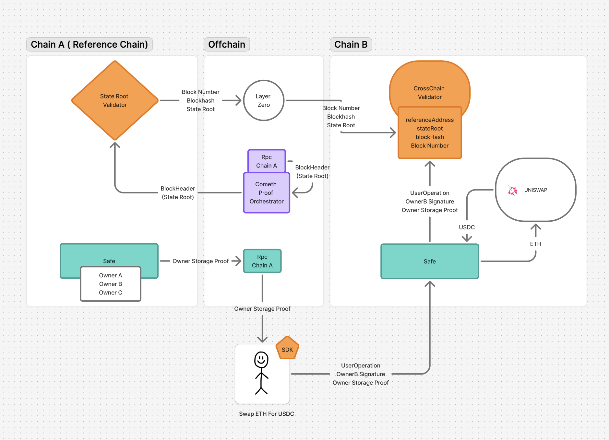

# Crosschain Lite keystore

This repository implements a **Lite Keystore and cross-chain pull mechanism** for **Smart accounts** using **Merkle Patricia Trie (MPT) proofs** for ownership verification. The flow allows an owner recorded on a Keystore contract on a parent chain (e.g., Ethereum) to control an account on a child chain (e.g., Arbitrum or Base) without requiring the owner to manage the child account state directly.

## 📖 General Overview

Key components:

**Storage-root-bridger:**

- **ETH Storage Proofs**: used to validate ownership across chains
- **Storage Slot Calculation**: Determines where Account ownership data is stored on the Keystore.
- **Merkle Patricia Trie (MPT) Proofs**: Used to validate Account ownership and state consistency.
- **StateRoot Storage**: On-chain contract that store the latest block stateRoot.
- **StateRoot Validator**: On-chain contract that validate a block header and broadcast it to Storage contracts.

**Lite Keystore and Storage Validator:**

- **Lite Keystore**: On-chain contract that will gather mappings of the owners for a given account.
- **Storage Verifier**: On-chain contract that verifies account & storage proofs against the stored stateRoot.
- **7579 Cross-Chain Validator**: 7579 enable validator that can validate a userop according to a storage proof and an ecdsa signature

---

## 🛠 How the flow works

#### **Key points**

1. **Deploy `LiteKeyStore`** on the main chains.
1. **Deploy `StateRoot Validator`** on the main chain.
1. **Deploy `StateRoot Storage`** on the child chains.
1. **Configure `Layerzero cross-messaging`**.
1. **Deploy `StorageVerifier`** on the child chains.
1. **Deploy `CrosschainValidator`** on the child chains.

1. A child account will add a master address as owner on the LiteKeystore
1. Add the latest block header (**Ethereum state root**) in `StateRoot Validator`.
1. Generate a **proof** using `eth_getProof` for the LiteKeystore contract’s storage.
1. Verify the proof **on-chain** using the `MTP` library.

## 🛠 State-root-bridger flow

We combine on-chain validation of the state root on the reference chain with an Arbitrary Messaging Bridge (AMB) to propagate it to other chains.

State Root Validator :
It receives RLP-encoded block headers, from which it extracts the stateRoot, blockNumber, and blockHash. To ensure the header originates from the canonical chain, it verifies its integrity by computing the hash and comparing it to the result of blockhash(blockNumber) on-chain. Since state root validation is performed entirely on-chain, anyone can submit a valid block header, enabling cross chain propagation .

State Root Distributor:
This contract encapsulates the Arbitrary Messaging Bridge (AMB) logic. Once a state root has been validated, it is sent to other chains through this contract.In the current implementation, we use LayerZero as the messaging layer. However, the design is modular, and we plan to support multiple bridges in the future to increase redundancy, decentralization, and trust minimization.

## 🛠 Storage verifier on destination chain

On the destination chain, storage proofs are used to verify that specific storage slot values are valid according to the bridged state root, enabling trustless and decentralized cross-chain verification.

State Root Storage:
This contract receives and stores the latest state root from the origin chain.

Storage Proof Verifier:
This contract acts as an on-chain proof verifier for the state of the reference chain. It leverages Merkle Patricia Trie (MPT) proofs to verify that specific storage slot values are valid for a given state root, enabling trustless validation of data originating from the reference chain.

## 🛠 ERC7579 compliant Validator verificaties userops on destination chain

This module must be enabled on the user's smart account to support cross-chain signer verification. When a UserOperation is received, the validator extracts a SignatureData structure containing:
A standard ECDSA signature from a key registered in the keystore,
A StorageProofData object that includes a Merkle proof showing the key is listed in the keystore at a specific storage slot.
Using the Storage Proof Verifier, the module then checks this proof against the latest bridged state root. If the verification is successful, the signer is considered valid, and the UserOperation is executed.

