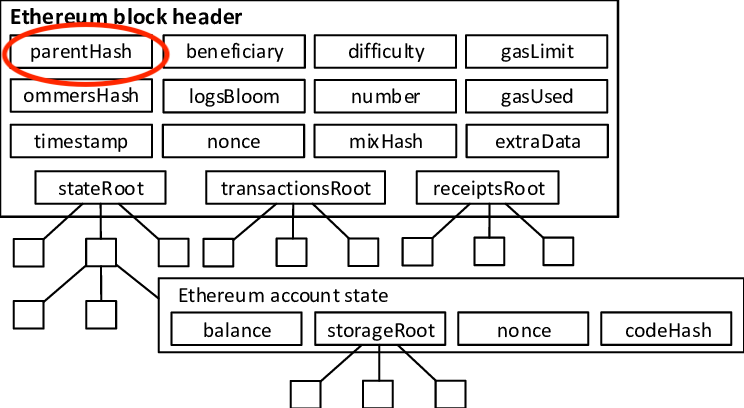

## 📜 Setup the Infrastructure

The implementation in this repository only covers the infrastructure which validate and broadcast the stateRoot used to validate the ownership of the Account.

1. Configure supported networks
2. Deploy the **StateRootValidator**
3. Deploy the **StateRootStorage**
4. Configure LayerZero
5. Add new block to the StateRootValidator
6. Verify that the broadcast of 'stateRoot' is successful

#### **1️⃣ Configure Supported networks**

It is important to update the config based on the networks you want to support. By default, it is configured for Base Sepolia and Arbitrum Sepolia:

- Env file

```md
SUPPORTED_NETWORKS=421614,84532
L0_DESTEID_421614=40231
L0_DESTEID_84532=40245
L0_ENDPOINT_ARBITRUM_SEPOLIA=0x6EDCE65403992e310A62460808c4b910D972f10f
L0_ENDPOINT_BASE_SEPOLIA=0x6EDCE65403992e310A62460808c4b910D972f10f
```

- Update layerzero.config.ts with your supported network

#### **2️⃣ Deploy the **StateRootValidator\*\*\*\*

- Deploy the **StateRootValidator** on the main chain: **[tags: validator]**

```sh
npx hardhat lz:deploy
```

#### **3️⃣ Deploy the **StateRootStorage\*\*\*\*

- Deploy the **StateRootStorage** on the children chains: **[tags: storage]**

```sh
npx hardhat lz:deploy
```

#### **4️⃣ Configure LayerZero**

- Execute LayerZero wiring to setup the cross-chain communication.

```sh
npx hardhat lz:oapp:wire --oapp-config layerzero.config.ts
```

#### **5️⃣ Add new block**

- Add new block to the StateRootValidator

```sh
npx hardhat run scripts/validatorUpdate.ts --network main
```

#### **6️⃣ Verify `stateRoot` in StateRootStorage**

- After successfully adding the block, you should verify the block in the StateRootStorage

```sh
npx hardhat run scripts/storageCheck.ts --network child
```

#### **7️⃣ CrossChain call**

- The stateRoot is now available on any required chain, allowing you to use it to validate the ownership of the Account using MTP validation.
- You are now on track to execute cross-chain transactions with your own cross-chain module.

#### 🔍 MPT Proof Verification

Ethereum uses **Merkle Patricia Trie (MPT) proofs** to manage its storage and account proof.

In order to verify that a proof is valid, we need to:

- verify the storage proof against the account.storageHash to make sure the storage is part of its account
- verify the account proof against the block.stateRoot to make sure the account is part of the block



##### **Steps to Verify a Proof**

1. Fetch `eth_getBlockByNumber` and get the blockNumber and stateRoot
2. Fetch `eth_getProof` data for the **Account contract’s owners mapping**.
3. Extract the Merkle proof:

- proof.accountProof
- proof.storageHash
- proof.storageProof[0]

4. Validate the proof **on-chain** using the `MTP` library.
