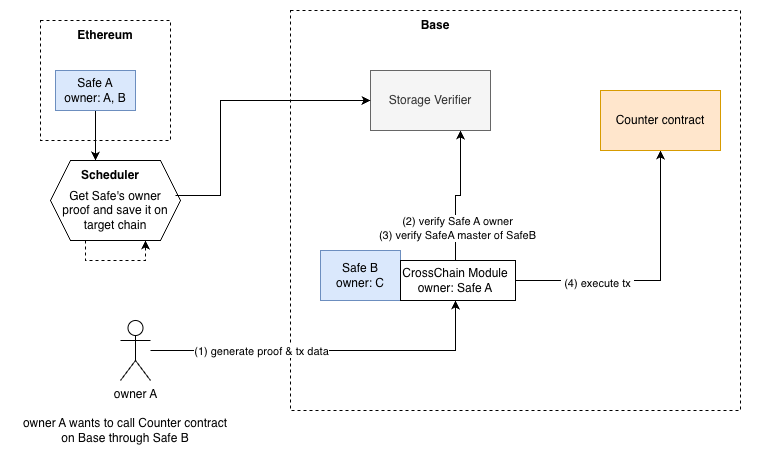
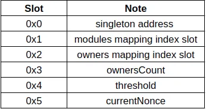

# Safe Cross-Chain Pull Flow

This repository implements a **cross-chain pull mechanism** for **Gnosis Safe** using **Merkle Patricia Trie (MPT) proofs** for ownership verification. The flow allows a Safe on a parent chain (e.g., Ethereum) to control a Safe on a child chain (e.g., Arbitrum or Base) without requiring the parent Safe to manage the child Safe directly.

The implementation in this repository only covers the infrastructure which validate and broadcast the stateRoot used to validate the ownership of the Safe.

## 📖 Overview


This flow enables the owner(EOA) of a given **Safe** (parent) on one blockchain to execute transactions on another blockchain through another child Safe using a **pull mechanism**. It leverages **Ethereum's storage proof system** to validate state across chains, ensuring ownership validity.

Key components:

- **Safe Hierarchy**: a Safe on chain A is defined as parent for a Safe on chain B
- **ETH Storage Proofs**: used to validate Safe ownership across chains
- **Storage Slot Calculation**: Determines where Safe ownership data is stored.
- **Merkle Patricia Trie (MPT) Proofs**: Used to validate Safe ownership and state consistency.
- **StateRoot Storage**: On-chain contract that store the latest block stateRoot.
- **StateRoot Validator**: On-chain contract that validate a block header and broadcast it to Storage contracts.
- **Storage Verifier**: On-chain contract that verifies account & storage proofs against the stored stateRoot.
- **Cross-Chain Module**: caller (owner on chainA) can execute a tx on chain B.

---

## 🛠 How the Pull Flow Works

Simplified flow of the cross-chain pull mechanism:


#### **Key points**

1. **Deploy `StateRoot Validator`** on the main chain.
1. **Deploy `StateRoot Storage`** on the child chains.
1. **Deploy `StorageVerifier`** on the child chains.
1. Add the latest block header (**Ethereum state root**) in `StateRoot Validator`.
1. Generate a **proof** using `eth_getProof` for the Safe contract’s storage.
1. Verify the proof **on-chain** using the `MTP` library.

#### **Execution Flow**

1. Parent Safe on Chain A:

- A user owns a Safe on the parent chain (e.g., Ethereum).

2. Child Safe on Chain B:

- A Safe on child chain (e.g., Arbitrum or Base).
- The parent Safe is set as owner of the child safe.
- The child Safe has a **cross-chain module** that allows the parent Safe to execute transactions.

3. Cross-Chain Pull:
   ⚠️ The infrastructure owner is responsible for keeping the StateRootStorage up to date

- The user prepares a transaction.
- The user generates Merkle Patricia Trie (MPT) proof of ownership from parent chain using `eth_getProof` call.
- The user calls the **cross-chain module** on the child Safe with tx data and the proof.
- If the proof is valid, the child Safe executes the transaction.

---

#### 🧮 Storage Slot Calculation

One key point of the storage proof validation is to understand how owners are stored and how to calculate the storage slot.



The owners slot is a chained list of address at the position 2 of the Safe contract storage.
The last address of the chained list will always be `0x1` as defined in the Safe contract.

In order to validate the storage proof, we need to know the key, the address of the owner we want to validate, and the value which is the next owner. Fortunately the call to `eth_getProof` will contain the value.

- **Key:** Safe address (`safeAddress`)
- **Slot Index:** `2`

```solidity
keccak256(abi.encode(key, index))
```

**Solidity Code for Slot Calculation:**

```solidity
function getOwnersSlot(address owner) public pure returns (uint256) {
    bytes32 slotIndex = bytes32(uint256(2));
    return uint256(keccak256(abi.encode(owner, slotIndex)));
}
```

**JavaScript Code to get eth_getProof for that slot:**

```typescript
const paddedAddress = ethers.zeroPadValue(owner, 32);
const paddedSlot = ethers.toBeHex(BigInt("0x2"), 32);
const concatenated = ethers.concat([paddedAddress, paddedSlot]);
const hash = ethers.keccak256(concatenated);

const proof = await network.provider.request({
  method: "eth_getProof",
  params: [safe, [hash], blockNumber],
});
```

The value at this storage slot should be the owner address following the owner we want to validate. It the user address is not an owner, the value will be `0x0`.

---

#### 🔍 MPT Proof Verification

Ethereum uses **Merkle Patricia Trie (MPT) proofs** to manage its storage and account proof.

In order to verify that a proof is valid, we need to:

- verify the storage proof against the account.storageHash to make sure the storage is part of its account
- verify the account proof against the block.stateRoot to make sure the account is part of the block


##### **Steps to Verify a Proof**

1. Fetch `eth_getBlockByNumber` and get the blockNumber and stateRoot
2. Fetch `eth_getProof` data for the **Safe contract’s owners mapping**.
3. Extract the Merkle proof:

- proof.accountProof
- proof.storageHash
- proof.storageProof[0]

4. Validate the proof **on-chain** using the `MTP` library.

---

## 📜 Setup the Infrastructure

1. Configure supported networks
2. Deploy the **StateRootValidator**
3. Deploy the **StateRootStorage**
4. Configure LayerZero
5. Add new block to the StateRootValidator
6. Verify that the broadcast of 'stateRoot' is successful

#### **1️⃣ Configure Supported networks**

It is important to update the config based on the networks you want to support. By default, it is configured for Base Sepolia and Arbitrum Sepolia:

- Env file

```md
SUPPORTED_NETWORKS=421614,84532
L0_DESTEID_421614=40231
L0_DESTEID_84532=40245
L0_ENDPOINT_ARBITRUM_SEPOLIA=0x6EDCE65403992e310A62460808c4b910D972f10f
L0_ENDPOINT_BASE_SEPOLIA=0x6EDCE65403992e310A62460808c4b910D972f10f
```

- Update layerzero.config.ts with your supported network

#### **2️⃣ Deploy the **StateRootValidator\*\*\*\*

- Deploy the **StateRootValidator** on the main chain: **[tags: validator]**

```sh
npx hardhat lz:deploy
```

#### **3️⃣ Deploy the **StateRootStorage\*\*\*\*

- Deploy the **StateRootStorage** on the children chains: **[tags: storage]**

```sh
npx hardhat lz:deploy
```

#### **4️⃣ Configure LayerZero**

- Execute LayerZero wiring to setup the cross-chain communication.

```sh
npx hardhat lz:oapp:wire --oapp-config layerzero.config.ts
```

#### **5️⃣ Add new block**

- Add new block to the StateRootValidator

```sh
npx hardhat run scripts/validatorUpdate.ts --network main
```

#### **6️⃣ Verify `stateRoot` in StateRootStorage**

- After successfully adding the block, you should verify the block in the StateRootStorage

```sh
npx hardhat run scripts/storageCheck.ts --network child
```

#### **7️⃣ CrossChain call**

- The stateRoot is now available on any required chain, allowing you to use it to validate the ownership of the Safe using MTP validation.
- You are now on track to execute cross-chain transactions with your own cross-chain module.
- example: [StorageVerifier](https://github.com/cometh-hq/crosschain-contracts-pull/blob/main/contracts/StorageVerifier.sol) & [Cross-chain Safe module](https://github.com/cometh-hq/crosschain-contracts-pull/blob/main/contracts/CrossChainModule.sol)
